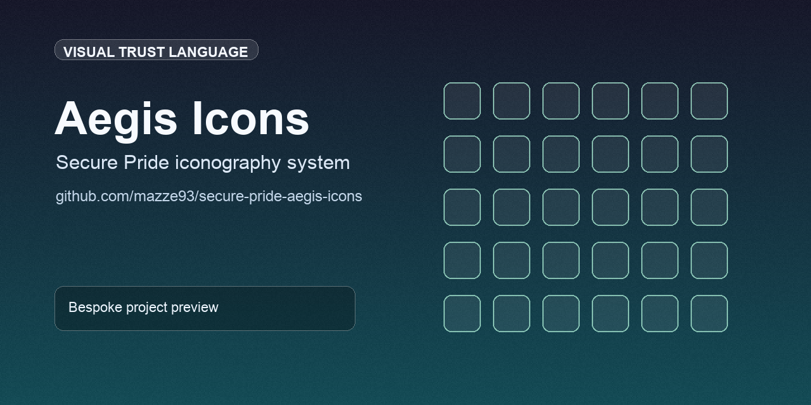

# secure-pride-aegis-icons

Iconography and visual trust primitives for Secure Pride interfaces and related tooling.

## At a glance
- Build a coherent icon language for security, privacy, and guidance states.
- Keep symbols legible at small sizes and accessible across themes.
- Maintain reusable packaging for product and content surfaces.

## Contents
- `icons/` - icon source assets and exports.
- `pack.json` - package metadata scaffold.

## Usage
Use this repository as the source of truth for icon assets referenced across Secure Pride projects.

## GitHub social preview
Upload `.github/social-preview.png` in repository `Settings -> General -> Social preview` to use the branded card on link shares.
